# SentinelAI 

SentinelAI is a full-stack incident-response system. It is intentionally split into layers so you can reason about the product as an operating model instead of a single application:

1. The platform control plane manages identities, clusters, incidents, jobs, and the agent runtime.
2. The dashboard gives operators a stable UI for clusters, incident transcripts, audit trails, and account state.
3. The edge MCP servers expose live infrastructure, logs, metrics, GitHub history, and runbooks to the agent.
4. The Target_Client stack generates the traffic, failures, and observability signals that make the demo meaningful.

The point of the repository is not only to show code; it is to show a complete feedback loop. The target client produces symptoms, the edge layer exposes evidence, the agent reasons about that evidence, the backend persists state, and the dashboard lets a human read and steer the result.

## System Architecture

### Layer Architecture


The dashboard talks to the backend through Next.js rewrites, which keeps the browser origin simple. The agent runtime mounts the versioned SaaS API and the auth router, then uses the MCP layer to gather live evidence from the target side. The backend owns persistence and identity, not the reasoning flow itself.

**Key semantics:**
- Arrows show request and evidence flow, not startup dependency order
- Dashboard is a client of the API; no reverse dependency
- Target_Client produces incidents and observability signals  
- Edge MCP servers expose infrastructure as tools to the agent  
- Agent reasoning and persistence happen in the platform layer

### Request-to-Investigation Flow



When an incident arrives or the user sends a follow-up question, the agent runtime orchestrates specialist agents to gather evidence in parallel, aggregates findings through a supervisor step, decides if more investigation is needed, and persists the final summary to the timeline.

### Backend Data Model



The backend persists organizations, users, clusters, incidents, timeline events, jobs, audit trails, and SLOs. The incident timeline event table is the core: each event represents a step in the investigation, and `pending_supervisor` marks events that are eligible for follow-up handling.

For implementation details and diagram maintenance, see [docs/architecture/README.md](docs/architecture/README.md).

## Repository Map

| Path | What It Teaches |
| --- | --- |
| [platform/README.md](platform/README.md) | How the control plane is started and what services it depends on |
| [backend/README.md](backend/README.md) | How data, auth, models, and seeding work |
| [sre_agent/README.md](sre_agent/README.md) | How the LangGraph runtime and SaaS API are assembled |
| [dashboard/README.md](dashboard/README.md) | How the operator UI is structured and how it authenticates |
| [edge_mcp_servers/README.md](edge_mcp_servers/README.md) | How evidence is exposed from the edge and why MCP is used |
| [Target_Client/README.md](Target_Client/README.md) | How incidents are generated in the demo environment |
| [tests/README.md](tests/README.md) | Which behaviors are validated in code |

## Quick Start

### 1. Set up environment values

Create a root `.env` from the template and verify the values that matter for your run mode:

```bash
cp .env.example .env
```

Minimum values to review:

- `SECRET_KEY` for signing JWTs.
- `LLM_PROVIDER` to select `ollama`, `groq`, or `gemini`.
- `OLLAMA_BASE_URL` if you are using a local model.
- `GROQ_API_KEY` if you are using Groq.
- `POSTGRES_USER`, `POSTGRES_PASSWORD`, and `POSTGRES_DB`.
- `PROMETHEUS_URL`, `LOKI_URL`, `GITHUB_TOKEN`, `GITHUB_REPO`, and `K8S_TOKEN` when you connect to real edge systems.

### 2. Start the platform stack

Use the platform compose file for the control plane and dashboard:

```bash
cd platform
docker compose up -d --build
```

This path is the fastest way to validate the backend, auth flow, database bootstrap, and dashboard rendering without the customer simulation. The helper script [platform/start.sh](platform/start.sh) does the same work and also guards against missing `.env` files.

### 3. Start the full demo path

If you want incidents, evidence, and UI behavior together, use the orchestration script at the repository root:

```bash
./main_start.sh
```

That script starts the Target_Client stack, then the platform stack, then the edge MCP relay. It is the closest thing to an end-to-end smoke test for the entire repo. On Windows, run it from Git Bash or WSL.

### 4. Open the main surfaces

- Dashboard: http://localhost:3002
- Agent/API docs: http://localhost:8080/docs
- Target client gateway: http://localhost:8000

## Development Workflows

### Platform-only smoke test

Use this when you want to validate the SaaS control plane without the noisy customer simulation:

```bash
cd platform
docker compose up -d --build
```

### Dashboard development

```bash
cd dashboard
npm ci
npm run dev
```

The dashboard proxies `/api`, `/auth`, `/metrics`, and `/agent` to the backend URL. That means the browser only needs the Next.js origin, while the backend handles the service split.

### Backend and agent development

The Python environment is defined by [pyproject.toml](pyproject.toml) and targets Python 3.12. The platform container uses `uv run` to apply Alembic migrations, seed the database, and launch the FastAPI runtime. If you are iterating locally, keep the same environment variables in sync with the compose stack so the runtime and the migration scripts see the same database settings.

## Operational Notes

- [\.env.example](.env.example) is the source of truth for root environment values.
- [backend/seed.py](backend/seed.py) refreshes the default admin password when the admin user already exists.
- [platform/docker-compose.yaml](platform/docker-compose.yaml) is the authoritative service topology for the platform stack.
- [dashboard/next.config.ts](dashboard/next.config.ts) is the source of API rewrite behavior for the browser.
- [Target_Client/start.sh](Target_Client/start.sh) is the authoritative bootstrap path for the customer simulation.

## Testing

Run the tests in layers so you know what failed:

- `pytest` for the Python repository tests.
- `cd dashboard && npm run lint` for UI-level validation.
- `python Target_Client/testing/test_layer0.py` for gateway and service reachability.
- `python Target_Client/testing/test_layer1.py` for observability health and scrape-target validation.

## Troubleshooting

- If the dashboard loads but API requests fail, confirm that `API_URL` in the platform compose file still points to `http://sre-agent-api:8080`.
- If the agent starts but cannot reason over incidents, check the LLM provider variables and confirm that the selected backend is reachable.
- If the target client starts but the platform sees no metrics, verify that Prometheus and Loki are listening on the host ports used by the MCP servers.
- If the admin login fails on a clean setup, confirm that the seed script ran and that `SEED_ADMIN_PASSWORD` matches the current `.env` value.

## What To Read Next

- [backend/README.md](backend/README.md) for the persistence and auth story.
- [sre_agent/README.md](sre_agent/README.md) for the runtime and LangGraph story.
- [dashboard/README.md](dashboard/README.md) for the UI story.
- [edge_mcp_servers/README.md](edge_mcp_servers/README.md) for the MCP evidence layer.
- [Target_Client/README.md](Target_Client/README.md) for the simulated customer system.
