# Target Client

This directory contains the simulated customer environment that the platform observes. It is the source of traffic, errors, slow queries, and resource pressure that produce the incidents shown in the dashboard.

This side of the repository is intentionally noisy. Its job is not to be elegant production software; its job is to create believable operational symptoms that the platform can investigate.

## What Runs Here

- `services/` contains the API gateway and the two demo microservices that the gateway fronts.
- `k8s/` contains the Kubernetes manifests for the demo application and its monitoring stack.
- `load-generator/` continuously drives traffic through the gateway.
- `chaos-panel/` provides a lightweight browser UI for injecting and inspecting chaos settings.
- `testing/` contains the layer-based smoke tests for the target environment.

## Startup

The primary entry point is [start.sh](start.sh). It builds the images, injects them into the local Kubernetes node used by Docker Desktop, applies the manifests, restarts the pods, and then prints the service URLs.

Common modes:

```bash
./start.sh
./start.sh --no-build
./start.sh --down
```

The script expects Docker Desktop and Kubernetes to be available. It uses the `demo-app` namespace and the monitoring manifests under [k8s/](k8s/).

## Runtime Model



The target client consists of three layers:

1. The API gateway that receives traffic from the load generator.
2. The checkout and inventory services that produce errors, latency, and status transitions.
3. The monitoring and chaos surfaces that make the system observable and controllable.

Those layers are what the platform sees when it reads metrics, logs, and cluster state through the edge MCP servers.

## Service URLs

- API Gateway: http://localhost:8000
- Checkout Service: http://localhost:8001
- Inventory Service: http://localhost:8002
- Load Generator: http://localhost:8003
- Chaos Panel: http://localhost:8888

The observability stack typically exposes Prometheus on 9090, Grafana on 3001, Alertmanager on 9093, and Loki on 3100.

## Why This Exists

The target client is not production code. It is a deliberately noisy system designed to create realistic operational signals for the SRE platform to inspect, correlate, and explain.

## How To Think About This Folder

If the platform is the brain, this folder is the body that keeps producing symptoms. The load generator creates demand, the services emit telemetry, and the monitoring stack makes that telemetry visible.

## Related Docs

- [services/README.md](services/README.md)
- [k8s/README.md](k8s/README.md)
- [load-generator/README.md](load-generator/README.md)
- [chaos-panel/README.md](chaos-panel/README.md)
- [testing/README.md](testing/README.md)