# Backend

The backend package owns the persistence, identity, and operational state for the platform. It is where the control plane stores users, organizations, clusters, incidents, jobs, audit trails, and SLOs, and it is also where the dashboard gets the auth endpoints it needs to create and authenticate users.

Think of this package as the repository’s system-of-record layer. The agent runtime uses it to persist evidence and state transitions, while the dashboard uses it to read and mutate the objects the operator sees.

## Responsibilities

- Define the relational model for organizations, users, clusters, incidents, jobs, SLOs, audit logs, and incident timeline events.
- Provide both async and sync SQLAlchemy session factories for the different runtime modes.
- Handle password hashing, JWT minting, and role-aware auth checks.
- Seed the default admin user and optional demo cluster at startup.
- Expose the `/auth` router used by the dashboard for login, registration, profile lookup, and password reset.
- Provide the backend pieces that the SaaS API and the agent runtime rely on for incident and cluster state.

## Data Model Overview

The core entities live in [models.py](models.py):

- `Organization` groups users and clusters under one tenant.
- `User` stores the account identity, hashed password, role, and active state.
- `Cluster` stores the connection details for the target environment and the operational state the UI displays.
- `Incident` represents an incident object scoped to a cluster.
- `IncidentTimelineEvent` captures the transcript and timeline for each investigation.
- `Job` tracks queued work for edge or agent execution.
- `AuditLog` and `AuditEvent` record actions for compliance and operational traceability.
- `SLO` stores service-level objective definitions and their current measurements.

The matching Pydantic contracts in [schemas.py](schemas.py) define what the HTTP layer sends and receives. When you are changing the API, you usually need to update both the model and the schema together.

## Database Access Pattern

[database.py](database.py) builds the database URL from `POSTGRES_USER`, `POSTGRES_PASSWORD`, `POSTGRES_HOST`, `POSTGRES_PORT`, and `POSTGRES_DB`.

Use cases:

- `AsyncSessionLocal` for normal FastAPI request handling.
- `get_db()` for dependency injection in async routes.
- `SessionLocal` for synchronous tasks or audit-style access.

The default host inside Docker is `postgres`. Local runs can override that with environment variables, but the compose topology assumes the service DNS names from [platform/docker-compose.yaml](../platform/docker-compose.yaml).

## Authentication And Identity

[auth.py](auth.py) provides password hashing, password verification, and JWT creation. The dashboard-facing router in [routers/auth.py](routers/auth.py) exposes the user flow:

- `POST /auth/register` creates a user and organization.
- `POST /auth/token` verifies credentials and returns an access token.
- `GET /auth/me` returns the current profile and organization metadata.
- `POST /auth/password` updates the password after checking the current password.

The dashboard stores the returned bearer token in both localStorage and a cookie, which keeps the browser middleware and the React auth state aligned.

## Seeding Behavior

[seed.py](seed.py) is the seed entry point used during platform startup. It performs two jobs:

1. Creates the default admin user if the account does not exist yet.
2. Refreshes the seeded admin password from the current environment if the account already exists.

If `SEED_CLUSTER_TOKEN` is set, the same seed script also creates or updates a demo cluster so the dashboard has something to display immediately after a clean bootstrap.

The admin values come from `SEED_ADMIN_EMAIL`, `SEED_ADMIN_PASSWORD`, and `SEED_ADMIN_ORG`.

## Migrations

Alembic configuration lives in [alembic/](alembic/). The migration env file imports the SQLAlchemy `Base` from [models.py](models.py) so schema generation stays tied to the actual model code.

Use [alembic/README.md](alembic/README.md) for operational commands and [alembic/versions/README.md](alembic/versions/README.md) for the revision history and schema evolution story.

## How This Package Is Used Elsewhere

- The agent runtime imports the models and session helpers to persist incidents, timeline events, and audit entries.
- The dashboard relies on the auth router for login, registration, and account display.
- The seed script is part of the platform startup path, so backend changes can affect whether a fresh deployment is immediately usable.

## What To Update When Changing The Backend

If you add a new model or alter an existing one, you usually need to update:

1. [models.py](models.py)
2. [schemas.py](schemas.py)
3. The relevant CRUD helpers in [crud.py](crud.py)
4. The migration history in [alembic/versions/](alembic/versions/)
5. Any router that returns the affected data

## Related Docs

- [alembic/README.md](alembic/README.md)
- [alembic/versions/README.md](alembic/versions/README.md)
- [../sre_agent/README.md](../sre_agent/README.md)
- [../dashboard/README.md](../dashboard/README.md)