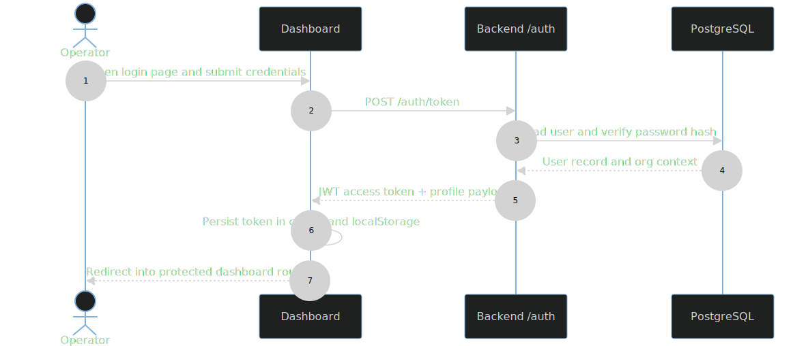

# Dashboard

This folder contains the Next.js operator UI for the SRE platform. It is the human-facing side of the system: if the backend and agent runtime are the machine, the dashboard is the control room.

It is used for authentication, cluster navigation, incident review, transcript follow-up, and audit inspection.

## Stack

- Next.js 16 with the App Router.
- React 19.
- Tailwind CSS 4 and shadcn/ui components.
- A small auth context that stores JWTs in both a cookie and localStorage.

## What The UI Does

- Presents the cluster overview and cluster-scoped incident list.
- Opens the incident workspace for live conversation and transcript review.
- Shows audit history for remediation and user actions.
- Exposes account controls such as profile display and logout.
- Polls the transcript and status endpoints so the operator sees the incident evolve without manual refresh.

## Development Commands

```bash
cd dashboard
npm ci
npm run dev
```

Other useful commands:

- `npm run build`
- `npm run start`
- `npm run lint`

The compose stack runs the dashboard on port 3002. The local dev server defaults to port 3000.

## Routing And Data Flow



The UI is split between route groups and the support code that makes those routes behave correctly:

- `middleware.ts` gates access to protected routes by checking for a token cookie.
- `next.config.ts` rewrites `/api`, `/auth`, `/metrics`, and `/agent` requests to the backend URL.
- `app/layout.tsx` applies the root fonts and wraps the app in `AuthProvider`.
- `app/(dashboard)/layout.tsx` supplies the protected shell, page titles, and account menu.
- `lib/auth-context.tsx` restores the session, decodes the JWT, and exposes the `api` helper.

That arrangement keeps the browser simple: the UI only needs one origin, one auth model, and one set of rewritten API routes.

### Login Sequence



This sequence shows the operator sign-in path end to end: the dashboard posts credentials to `/auth/token`, the backend verifies the password hash, and the returned JWT is stored in both the cookie and localStorage so middleware and React state stay aligned.

## Design And Interaction Model

The dashboard intentionally separates reusable primitives from feature-specific components:

- `components/ui/` contains the generic shadcn primitives.
- `components/dashboard/` contains the workflow-specific views for clusters, incidents, metrics, and accounts.

The incident workspace is the most complex screen in the application. It merges timeline events, transcript summaries, follow-up messages, and live polling into one continuous operator narrative.

## Key Feature Areas

| Path | Purpose |
| --- | --- |
| [app/README.md](app/README.md) | Route groups and application shell |
| [components/README.md](components/README.md) | Feature components and shadcn primitives |
| [lib/README.md](lib/README.md) | Auth context, API helper, and utility helpers |

## Operational Notes

- The dashboard expects the platform API to be reachable through the Next.js rewrites.
- Login posts to `/auth/token` and then stores the bearer token for the rest of the session.
- Cluster and incident pages are cluster-scoped, so route parameters matter to the API requests.
- The dashboard build depends on `npm ci` because the repository does not ship with node modules checked in.

## Related Docs

- [app/README.md](app/README.md)
- [components/README.md](components/README.md)
- [lib/README.md](lib/README.md)
- [../platform/README.md](../platform/README.md)