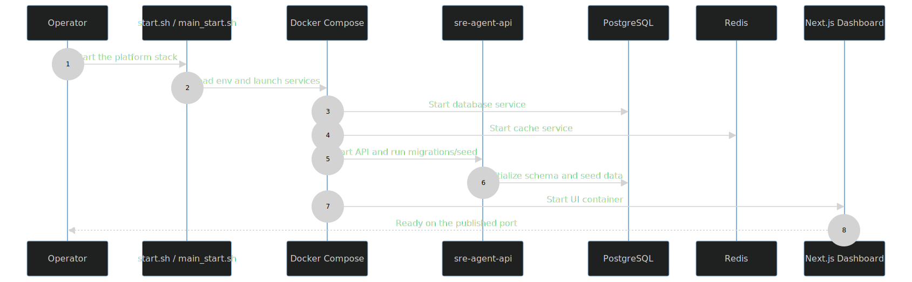

# Platform

This directory is the bootstrap and runtime shell for the SaaS control plane. It is responsible for pulling the Python backend, the dashboard, and the supporting infrastructure into one compose network with one repeatable startup path.

The platform is the layer you use when you want to answer questions like:

- What services must be alive for the dashboard to work?
- What databases and caches does the agent runtime depend on?
- What environment variables control the model provider and cluster bootstrap behavior?
- How does the repository move from code on disk to a running demo stack?

## Compose Topology

The compose file starts the following services:

- PostgreSQL for relational persistence.
- Redis for transient state and coordination.
- Qdrant for vector-backed memory use cases.
- `sre-agent-api` for the FastAPI + LangGraph control plane.
- `dashboard` for the Next.js operator interface.

The compose network also wires the control plane to host-accessible services such as Prometheus, Loki, and the MCP relay when you are using the full demo path.

## Start Sequence



### Bootstrap Sequence



This sequence shows the startup order more explicitly: operator script, compose orchestration, database and cache startup, backend migrations and seed, and dashboard readiness.

Standard startup:

```bash
cd platform
docker compose up -d --build
```

Scripted startup:

```bash
./start.sh
```

The script does three important things before it starts containers:

1. Checks for a root `.env` file.
2. Creates one from [../.env.example](../.env.example) when missing.
3. Sources the variables into the shell so Docker Compose sees the same values the application sees.

For the full end-to-end demo, use [../main_start.sh](../main_start.sh) so the target client and edge MCP servers are included.

## Startup Order And Behavior

The platform container starts the backend API after migrations and seed data are applied. That means the admin account and optional demo cluster are available before the dashboard renders its first authenticated view.

The dashboard container is built from [../dashboard/](../dashboard/) and points at the API through `API_URL=http://sre-agent-api:8080`. The browser itself only needs the Next.js origin and the route rewrites in [../dashboard/next.config.ts](../dashboard/next.config.ts).

## Ports And Endpoints

- Dashboard: http://localhost:3002
- Agent API: http://localhost:8080
- Agent API docs: http://localhost:8080/docs

## Environment Variables

Use [../.env.example](../.env.example) as the source of truth. The most important values are:

- `SECRET_KEY` for JWT signing and auth consistency.
- `LLM_PROVIDER` to select the model backend.
- `OLLAMA_BASE_URL`, `OLLAMA_MODEL`, and `OLLAMA_NUM_CTX` when using Ollama.
- `GROQ_API_KEY` when using Groq.
- `POSTGRES_*` for database connectivity.
- `REDIS_URL` and `QDRANT_URL` when overriding defaults.
- `PROMETHEUS_URL`, `LOKI_URL`, `MCP_*_URI`, and source-control settings when the platform talks to live edge services.

## Operational Notes

- The platform stack assumes Docker Desktop or another environment that can resolve the host-exposed observability services used by the MCP layer.
- [backend/seed.py](../backend/seed.py) refreshes the default admin password if the seeded account already exists.
- If you are using local Ollama instead of a host-accessible instance, adjust `OLLAMA_BASE_URL` before starting the stack.
- The same compose file drives both local smoke tests and the full demo path, so this file is the best place to inspect service dependencies.

## When To Use This Layer

Use the platform stack when you want to validate:

- the dashboard login and routing path,
- the backend persistence and auth path,
- the model-provider integration,
- or the database bootstrap and migration sequence.

Use [../Target_Client/README.md](../Target_Client/README.md) and [../edge_mcp_servers/README.md](../edge_mcp_servers/README.md) when you need the incident-generating portion of the story.

## Related Docs

- [../README.md](../README.md)
- [../backend/README.md](../backend/README.md)
- [../sre_agent/README.md](../sre_agent/README.md)
- [../dashboard/README.md](../dashboard/README.md)
- [../edge_mcp_servers/README.md](../edge_mcp_servers/README.md)