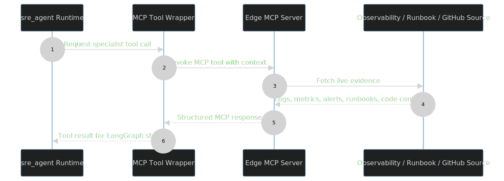
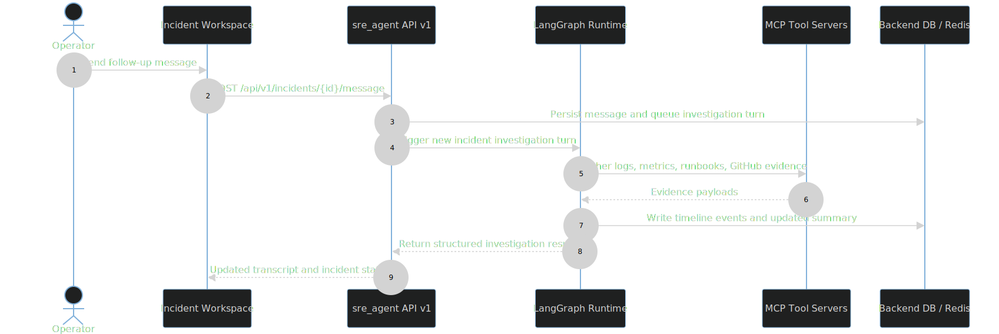

# sre_agent

This package is the control plane and reasoning engine for the platform. It is where the incident-response loop actually lives: the runtime receives a user prompt or alert, gathers evidence through MCP-backed tools, reasons over the evidence with LangGraph, persists the resulting state, and exposes the transcript and outcome back to the dashboard.

This is the part of the repository that most clearly turns the system from a CRUD backend into an autonomous SRE assistant.

## What Lives Here

- [agent_runtime.py](agent_runtime.py) starts the FastAPI app, mounts the SaaS API routers, and exposes the runtime endpoints.
- [multi_agent_langgraph.py](multi_agent_langgraph.py) builds the LangGraph workflow and wires together the specialist agents.
- [agent_nodes.py](agent_nodes.py) contains the concrete specialist agent factories.
- [supervisor.py](supervisor.py) routes the flow and aggregates the final response.
- [agent_state.py](agent_state.py) defines the state object that travels through the graph.
- [mcp_tool_wrapper.py](mcp_tool_wrapper.py) adapts MCP servers into tools the graph can use.
- [prompt_loader.py](prompt_loader.py) assembles the prompt templates for the runtime.
- [config/](config/) contains the declarative agent registry and the prompt catalog.
- [api/v1/](api/v1/) contains the versioned SaaS API routes that the dashboard calls.

## Runtime Story

The runtime is designed to operate in two modes:

1. Control-plane/API mode, where the FastAPI application is available and the local AI loop may be disabled.
2. Cluster-managed mode, where the full graph is initialized and the assistant runs investigations using the selected provider.

At startup the service loads environment variables, configures logging, and initializes the agent graph when the selected mode requires it. The provider selection is controlled by `LLM_PROVIDER`, and the code path supports Ollama, Groq, and Gemini. That choice determines which model backend the supervisor and specialist agents will use.

### Incident Investigation Loop

The runtime flow is intentionally layered:

- A request enters through `POST /invocations`.
- The graph prepares state and determines the initial routing.
- Specialist agents gather infrastructure, log, metrics, runbook, or GitHub evidence.
- The supervisor interprets the findings and decides whether to continue, summarize, or hand control back to the user.
- The final summary is written into incident timeline events and returned to the caller.

### MCP Tool Integration

The MCP tool wrapper bridges the LangGraph specialist agents to remote evidence servers, so the agent can access live cluster state, metrics, logs, code changes, and operational runbooks without embedding provider-specific logic.

### MCP Evidence Sequence

This sequence shows the runtime-to-wrapper-to-server call chain when a specialist agent needs live evidence from Prometheus, Loki, GitHub, or runbook sources.

### Incident Follow-up Sequence

This sequence shows how a dashboard follow-up message becomes a queued investigation turn, new evidence collection, and a persisted timeline update.

## Main Entry Points

- `POST /invocations` sends a prompt into the graph and returns the structured response.
- `GET /ping` is the container health check.
- `GET /agent/state` exposes runtime state for the dashboard and debug flows.
- `/api/v1/*` exposes the SaaS endpoints for clusters, incidents, jobs, metrics, SLOs, alerts, and mission control.

## State And Persistence

The runtime depends on a few state and persistence helpers that are worth understanding together:

- [agent_state.py](agent_state.py) defines the graph state and the typed result payloads.
- [redis_state_store.py](redis_state_store.py) stores pending follow-up state so the dashboard can resume the conversation correctly.
- [incident_timeline.py](incident_timeline.py) turns model output into the structured transcript events that the UI renders.
- [callbacks.py](callbacks.py) and [logging_config.py](logging_config.py) control runtime observability and logging shape.

This division matters because it keeps the graph logic focused on reasoning and keeps persistence concerns in explicit helper modules.

## Configuration And Prompts

The runtime is heavily configuration-driven:

- [config/agent_config.yaml](config/agent_config.yaml) maps specialist roles to tool names.
- [config/prompts/](config/prompts/) contains the supervisor and specialist prompt templates.
- [prompt_loader.py](prompt_loader.py) is responsible for assembling those templates into the active runtime instructions.

If you add a new tool or a new specialist role, start in the config folder before touching the graph code. That keeps the system easier to review and avoids hard-coded prompt/tool coupling.

## API Surface And Dashboard Relationship

The dashboard does not call the runtime randomly. It uses the route structure exposed by `api/v1` to retrieve clusters, incidents, jobs, metrics, SLOs, and transcript data. The transcript and follow-up endpoints are what power the incident workspace and its live conversation thread.

The most important cross-layer contract is the incident timeline. Once the runtime writes a transcript event, the dashboard uses that event stream to keep the incident panel in sync with the current investigation state.

## Things To Read Together

- [api/README.md](api/README.md) for the versioned API surface.
- [config/README.md](config/README.md) for agent/tool mapping.
- [../backend/README.md](../backend/README.md) for the persistence model.
- [../dashboard/README.md](../dashboard/README.md) for the consumer side of the runtime.

## Common Extension Points

When the assistant behavior changes, it usually happens in one of these places:

- Add or refine a specialist in [agent_nodes.py](agent_nodes.py).
- Change routing and summary behavior in [supervisor.py](supervisor.py).
- Adjust graph topology in [multi_agent_langgraph.py](multi_agent_langgraph.py).
- Change prompt behavior in [config/prompts/](config/prompts/).
- Add a new tool wrapper in [mcp_tool_wrapper.py](mcp_tool_wrapper.py).

## Related Docs

- [api/README.md](api/README.md)
- [config/README.md](config/README.md)
- [../backend/README.md](../backend/README.md)
- [../dashboard/README.md](../dashboard/README.md)