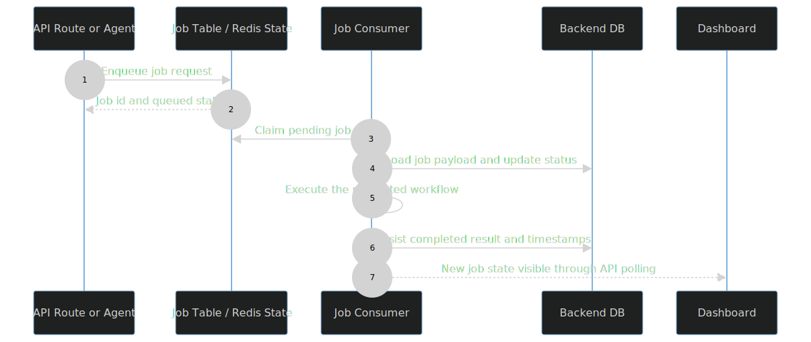

# sre_agent API v1

This folder contains the concrete HTTP routes for the current SaaS contract. If the dashboard talks to clusters, incidents, jobs, metrics, SLOs, alerts, or mission-control views, it is almost certainly hitting one of the modules here.

## Route Groups

- [clusters.py](clusters.py) handles cluster list/detail operations and cluster-scoped data.
- [incidents.py](incidents.py) handles incident lifecycle, transcripts, messages, logs, and status views.
- [jobs.py](jobs.py) handles queued work sent to the agent or edge.
- [metrics.py](metrics.py) exposes health and golden-signal style metrics.
- [mission_control.py](mission_control.py) covers audit and approval-style workflows.
- [slos.py](slos.py) manages SLO definitions and SLO health reporting.
- [alerts.py](alerts.py) receives alert-webhook traffic.
- [auth_deps.py](auth_deps.py) provides current-user and organization dependencies used by the other routes.

### Job Queue System

The job system orchestrates work across multiple layers. Jobs are queued when the API receives agent invocations or edge operation requests. Each job lifecycle is tracked in the database and can be monitored via the `/jobs` endpoints.

### Job Lifecycle Sequence

This sequence shows how a queued job moves from API submission to a consumer process and then into persisted job state and UI-visible status updates.

## How The Contract Works

The most important design rule in this folder is that the route modules should read like product capabilities, not like generic API plumbing. Each file owns one concern, and each concern aligns with a visible area in the dashboard.

For example:

- Incident follow-up messages are written as new timeline events, which in turn can queue a new investigation turn.
- The transcript endpoints power the conversation pane, summary rendering, and the incident status lifecycle in the dashboard.
- Cluster routes are the source of truth for the cluster list and the incident table that appears after the user selects a cluster.

## Extension Guidance

When adding or changing routes in this layer:

1. Keep each route module narrow enough that its purpose is obvious from the filename.
2. Reuse the auth dependency helpers rather than re-parsing the token in each route.
3. Return schema-backed payloads from [../../backend/schemas.py](../../backend/schemas.py) wherever practical.
4. Update the dashboard README if you add a new visible workflow.
5. Add a new version directory when you make a contract-breaking change.

## Debugging Tips

- If the dashboard shows stale incident data, check the transcript and status endpoints first.
- If a follow-up message appears to be ignored, inspect the timeline event that the incident route created and verify that it is marked correctly.
- If a route needs organization context, make sure it still uses the shared auth dependency instead of an ad hoc token parser.

## Related Docs

- [../README.md](../README.md)
- [../../../dashboard/README.md](../../../dashboard/README.md)
- [../../../backend/README.md](../../../backend/README.md)